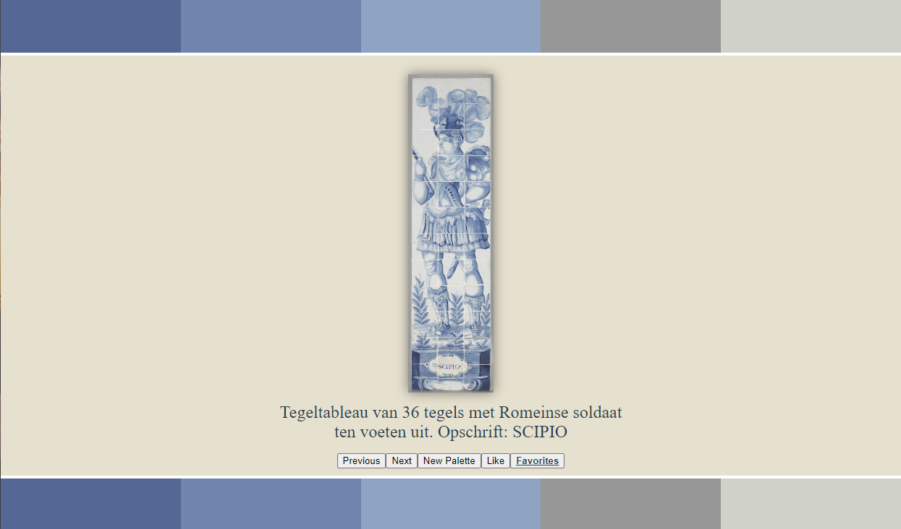

# Palette Gallery

This web app allows you to cycle through and favorite famous works of pottery, paintings, and sculptures belonging to specific color palettes.

All images and palettes sourced from Google Arts & Culture's awesome [Art Palette](https://artsexperiments.withgoogle.com/artpalette/) app.

<figure>

<figcaption align = "center" style="font-size: 6">My intention is to serve this via a Raspberry Pi to a framed monitor. All of the UI buttons will be replaced by physical buttons on the side of the frame.</figcaption>
</figure>

Details:
* Front-end: Vue.js
* Scraping: Python (Selenium, BeautifulSoup)

TODO
- Create api route that takes palette and uses pupeteer to fetch images
  - update state with new images and display first
  - add next and last image functionality
  - if this doesn't work just use scraped images
- Create front end
  - should randomly generate an initial 5 color palette
  - this populates the palette bar
- add color pickers
  - these should call the same api route as the last step
- add image deletion functionality to pickers
  - make sure api route + state work with this

how to use pupeteer in a next api route
- debugging discussion: https://github.com/orgs/vercel/discussions/124
- vercel's specific example: https://github.com/vercel/virtual-event-starter-kit/blob/main/lib/screenshot.ts
  - vercel node version and chrome-aws-lambda/pupeteer core versions matter
- guide off of more issues from the approach above: https://gist.github.com/kettanaito/56861aff96e6debc575d522dd03e5725